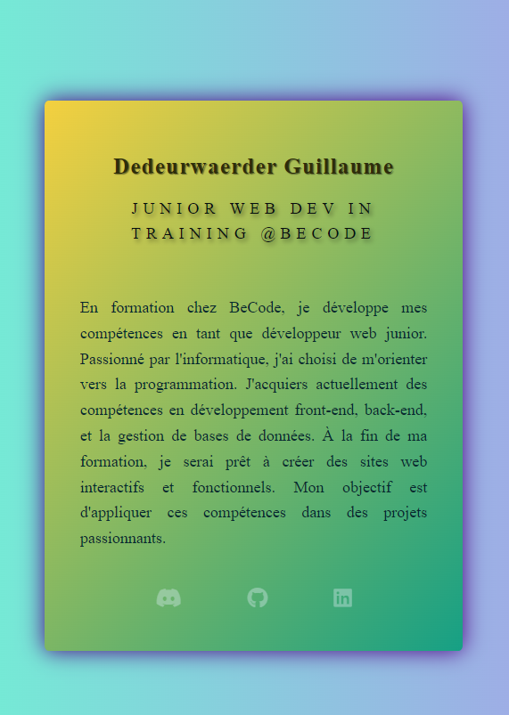

# Défi VCard :credit_card:

Ce projet a été réalisé dans le cadre de l'exercice VCard (Virtual Card) :id:. L'objectif de cet exercice était d'utiliser des techniques de positionnement CSS pour créer une carte virtuelle unique. Cette carte virtuelle sert de carte de visite en ligne et constitue un moyen efficace de mettre en pratique les compétences en HTML et CSS. :memo:

## Objectifs d'apprentissage :brain:

À la fin de cet exercice, vous devriez être capable de :

- Rédiger un HTML sémantique de meilleure qualité :page_facing_up:
- Utiliser le positionnement CSS pour créer des mises en page uniques :art:

## Mission :dart:

1. Création du repository :white_check_mark: J'ai créé un nouveau repository appelé "VCard" pour stocker les fichiers du projet.

2. VCard en HTML et CSS :white_check_mark: J'ai rédigé la carte virtuelle en utilisant HTML et CSS. J'ai veillé à ce que le code HTML soit sémantique et propre, tout en appliquant des styles CSS pour améliorer l'apparence de la carte virtuelle.

3. Positionnement CSS :white_check_mark: J'ai utilisé des techniques de positionnement CSS pour organiser et disposer les éléments de la carte virtuelle de manière créative.

4. Commit/Push :white_check_mark: J'ai régulièrement effectué des commits et des pushs vers le référentiel GitHub pour suivre l'évolution du projet.

5. Déploiement :white_check_mark: J'ai déployé la carte virtuelle sur GitHub Pages pour la rendre accessible en ligne. Lien : [Vcard-Mobile_responsive](https://zanko19.github.io/Vcard2/):globe_with_meridians:

## Option :sparkles:

Pour ajouter une touche d'originalité à ce projet, j'ai également envisagé l'options suivante :

- Utilisation de dégradés :white_check_mark: Au lieu de simplement utiliser une palette de couleurs unies, j'ai exploré l'utilisation de dégradés pour ajouter de la profondeur à la mise en page. :rainbow:

## Ressources :books:

- [Règles CSS](https://quickref.me/css3)
- [Positionnement CSS](https://developer.mozilla.org/fr/docs/Web/CSS/position)
- [Mise en page CSS](https://developer.mozilla.org/fr/docs/Learn/CSS/CSS_layout/Introduction)

N'hésitez pas à explorer le code source de ce repository pour voir comment la carte virtuelle a été construite. Cet exercice a été une excellente opportunité pour améliorer mes compétences en HTML et CSS, en particulier en matière de responsive mobile. :muscle:
